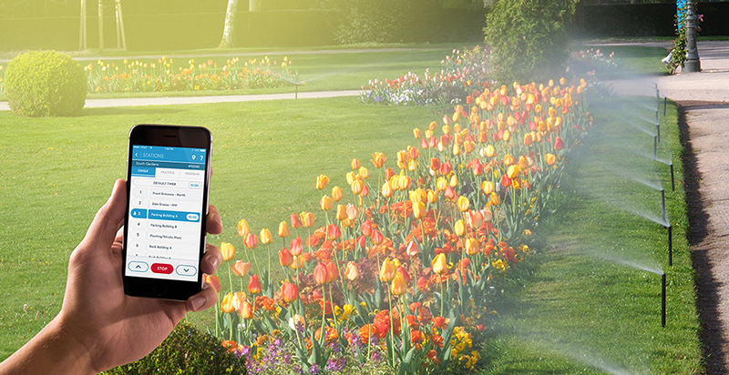

# Final project python - Building and Managing a Greenhouse

## Description

Python program to simulate the operation of a greenhouse. 
The greenhouse has various components, including plants, environmental sensors, irrigation systems, and a controller.

## Running

```
git clone https://github.com/RoiAtias/FinalProjectPython.git
cd FinalProjectPython
python main.py
```

## Instructions
1. Run main.py
2. Run Simulator - running of all the parts in the system that include the irrigation system and the growth of the plants.
3. Tester - Plants - Running the test of the plants independently of the other components in the system
                     (You can change the values set in the appSettings.json file).
4. Tester - IrrigationSystem - Running the irrigation system test while watching the growth data of the plants
                     (You can change the values set in the appSettings.json file).
5. Tester - GreenHouseController - Complete running of all the parts in the system which includes feeding an amount 
                                   of water to the irrigation system and watching the plant grow
                     (You can change the values set in the appSettings.json file).

   
<p align="center">

</p> 


## Author
[Roi Atias](roiat4@gmail.com)